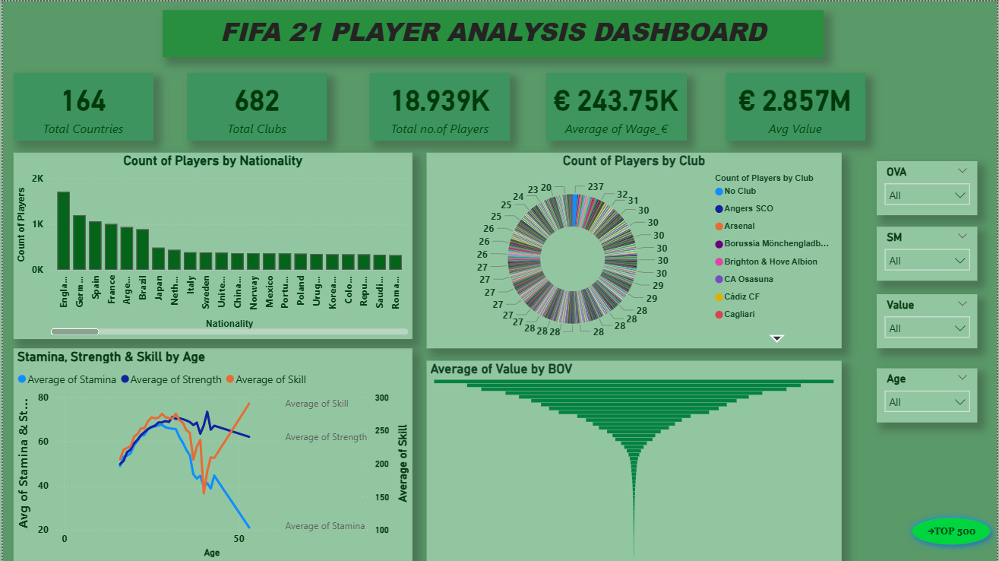
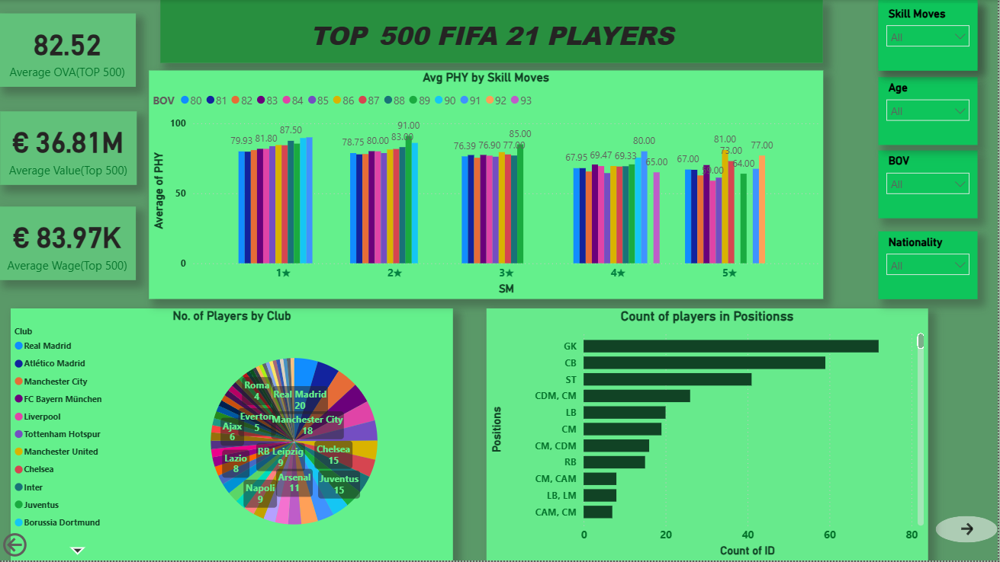
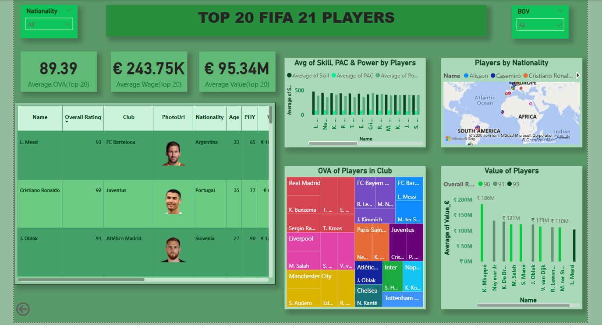
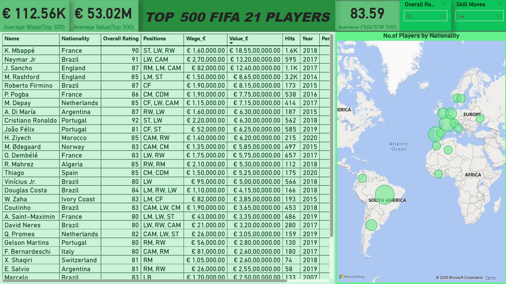

# ⚽ FIFA 21 Players Analysis Dashboard

## 📊 Project Overview
This project presents an interactive data analysis of FIFA 21 player data using Power BI. The dashboard explores player performance, market value, and distribution across clubs and countries, enabling comparative and trend-based analysis.

The analysis is performed at three levels:
- Overall dataset (all players)
- Top 500 players
- Top 20 highest-rated players

---

## 🛠 Tools & Technologies
- Microsoft Power BI
- Microsoft Excel
- DAX (Data Analysis Expressions)

---

## 📂 Dataset Summary
- Total Players: 18,939  
- Total Clubs: 682  
- Total Countries: 164  

The dataset includes player attributes such as:
- Overall Rating (OVA)
- Potential (POT)
- Value & Wage
- Position
- Nationality & Club
- Physical attributes (Stamina, Strength)
- Skill Moves & BOV (Best Overall Value)

---

## 📈 Key Analysis Performed

### 🔹 Player Segmentation
- Analyzed all players, top 500 players, and top 20 elite players
- Compared performance and value across different player tiers

### 🔹 Attribute Analysis
- Player performance analyzed based on:
  - Nationality
  - Club
  - Age
  - Stamina & Strength
  - Skill Moves

### 🔹 Aggregated Metrics
- Average Wage, Value, and Overall Rating (OVA)

### 🔹 Distribution Analysis
- Number of players by club
- Count of players by position
- Player distribution across countries

### 🔹 Club-Level Insights
- Total player value per club
- Average OVA of players within clubs

---

## 📌 Key Insights
- Higher-rated players tend to have significantly higher market value and wages  
- Top 500 and top 20 players show stronger physical and skill attributes compared to overall players  
- Player distribution is uneven, with certain clubs and countries dominating high-value players  
- Skill moves and physical attributes show a positive relationship with player performance  
- Clubs with higher average OVA generally have higher total squad value  

---

## 📸 Dashboard Preview

---

